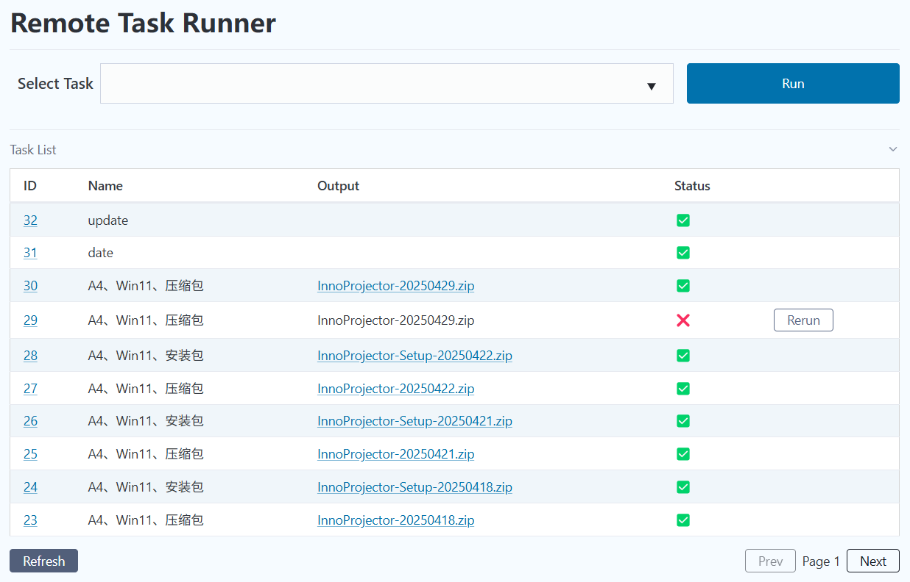

# Remote Task

A simple web server that serve APIs to run [just](https://github.com/casey/just) tasks remotely.

Every project has a work directory with a `justfile` and an output directory for the
built packages. `WORK_DIR` and `OUTPUT_DIR` from `.env` are only used to create the
first project on startup, projects and their recipes are managed on the web page.
A recipe is a name and the command that is passed to `just` in the project directory.

- `GET /projects` - List projects
- `POST /projects` - Create a project with `name`, `path` and `output`
- `GET /project/{id}` - Get a project and its recipes
- `POST /recipes` - Create a recipe, or update it when `project` and `name` already exist
- `POST /run` - Shedule a new task, the optional `project` field selects the project
- `POST /reset/{id}` - Reset task status so it will be run again
- `POST /canel/{id}` - Delete a task from shedule
- `GET /list/{page}?project={id}` - Get a list of recent tasks of a project

See `test.rest` for how to use the APIs.

An example web page is created for demonstration.

### Dependencies

- Axum: Web server framework
- SeaORM: Sqlite database operations
- Dioxus: Create web pages

### How to use
1. Install [just](https://github.com/casey/just)
2. Edit `.env` file to set environment variables
3. Inside the project directory create a `justfile` and define your tasks
4. Start the server
5. Create projects and their recipes on the web page, tasks run in the project directory
6. Use [xh](https://github.com/ducaale/xh) or VSCode REST client to call the APIs.
7. Generate a token for authentication
   - `remote-task generate-token <username> <days>`
   - The token will be written to `token.txt`

### How to build
1. Run `just build --release` to build the server
2. Run `just run --release` to run the server